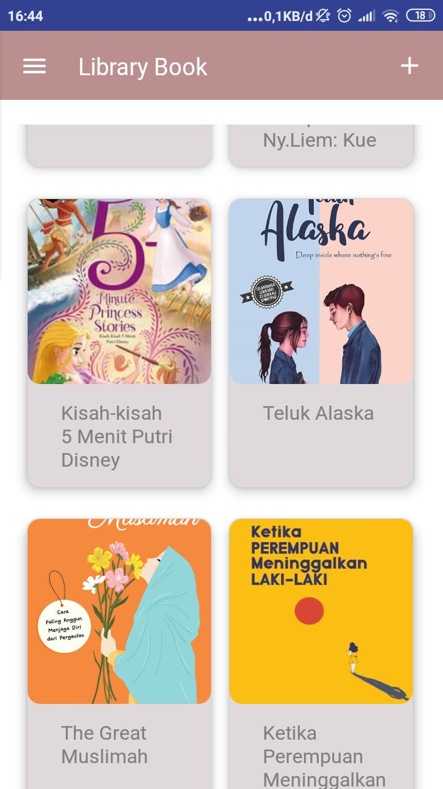

<h2 align="center">Library Book</h1>

## Introduction

Music Game App is an application playing game that you must touch a button and follow guidance button 

## Requirements

- `npm`
- `react-native-cli`
- [Server](https://github.com/muhammadrisano/Library-book-backend-expressjs)

## Usage

- Clone or download this repo first
- Open your terminal 
- `cd book-library-reactnative`, `npm install` and `react-native link`
- After that, run backend first
- Connect your phone to the pc or laptop and make sure your phone is connected with debugging mode
- Finnaly, type `react-native run-android` and wait for the process to complete

## Demo

### First Page

  
### Register Page

### Main Page

### Leaderboard Page

  
